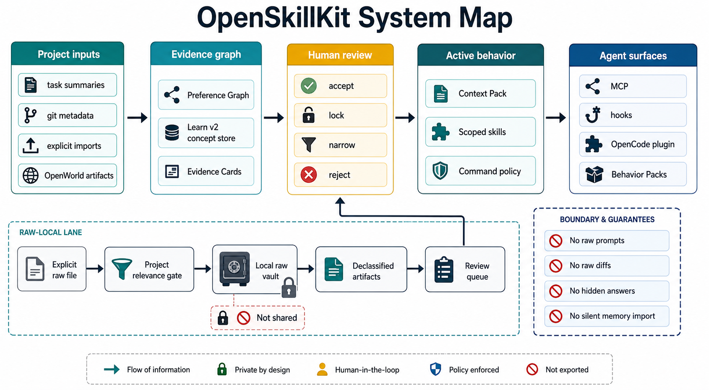
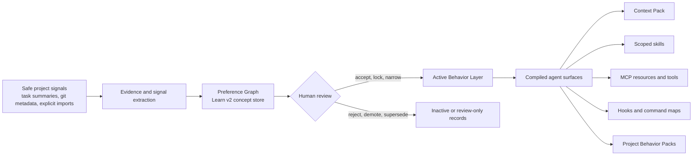
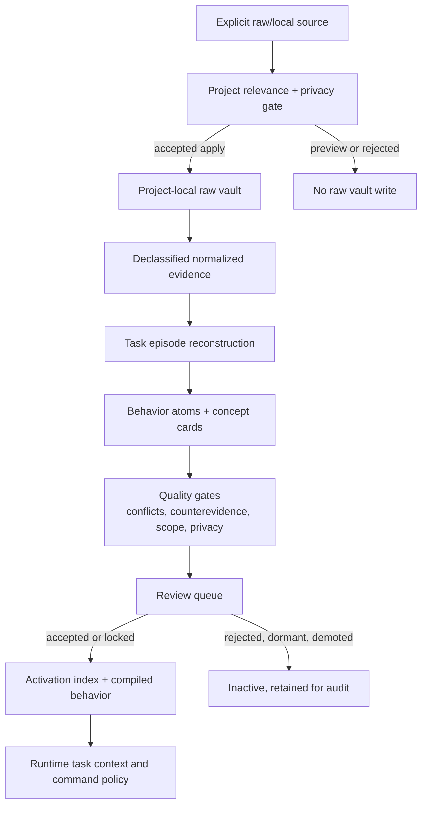

# OpenSkillKit

OpenSkillKit is a local-first behavior layer for AI coding agents. It lets a
repository teach agents how work should be done there, without training a model,
uploading private prompts, or silently importing user memories.

The core idea is an Adaptive Skill Graph: safe project signals, reviewed task
outcomes, explicit interaction imports, and grounded research artifacts become
reviewable behavior. Accepted behavior then compiles into the surfaces agents
already understand: Context Packs, skills, hooks, MCP tools, command maps,
OpenCode plugin files, and Project Behavior Packs.

## Why It Exists

AI coding agents still need project-specific judgment: which tests matter, which
patterns are preferred, which commands are risky, where generated files live,
how review feedback should change future behavior, and what evidence is safe to
share. Most projects encode that knowledge in scattered docs, old PR comments,
terminal habits, and reviewer memory.

OpenSkillKit makes that knowledge explicit and auditable. It captures only
approved local signals, turns them into behavior candidates, asks humans to
review them, and ships the safe subset back to agents as normal project files.

## What It Does

- Loads relevant project behavior before an agent starts work.
- Records safe task summaries after work finishes.
- Learns review-gated preferences, workflows, command policies, and scoped
  behavior from selected sources.
- Runs Learn v2 raw-local learning over explicit files while keeping raw evidence
  in a project-local vault and writing only declassified artifacts outward.
- Builds OpenWorld research, anchors, verifier artifacts, and review-only skill
  proposals for unfamiliar domains.
- Compiles accepted behavior into Context Packs, scoped skills, MCP resources,
  hooks, command maps, and host plugin bundles.
- Exports Project Behavior Packs that exclude private events, raw prompts, raw
  diffs, raw vault records, review drafts, and local run outputs by default.

## What Makes It Different

OpenSkillKit is not a prompt template, shared memory dump, or hosted telemetry
service. Its design choices are narrower and more inspectable:

| Principle | What it means |
|---|---|
| Local first | Project state lives under `.openskill-kit/`; raw evidence stays local unless a user explicitly exports safe artifacts. |
| Review before activation | Learned behavior starts as candidates. `/osk review` decides what becomes active. |
| Evidence over vibes | Preferences carry evidence cards, confidence, scope, counterevidence, and calibration data. |
| Agent-native output | Behavior compiles into skills, MCP resources, hooks, and command files instead of requiring a new editor. |
| Explicit privacy boundary | Raw prompts, raw diffs, secrets, hidden benchmark answers, private evidence blobs, and raw interaction imports are excluded from compiled and shared artifacts. |
| Proof-aware claims | Evals, verifier reports, and proof ladders state what has been proven and what remains future work. |

## Quickstart

OpenCode is the primary full-feature harness target. Generic MCP, Codex, Claude
Code, and Cursor attach paths are available with conservative preview-first
behavior.

```bash
npm install
npm run build

# Preview setup first, then apply only after reviewing the plan.
npx openskill-kit osk setup --host opencode
npx openskill-kit osk setup --host opencode --yes

# Preview uninstall first. Local .openskill-kit state is preserved unless --delete-state is used.
npx openskill-kit osk uninstall --host opencode
npx openskill-kit osk uninstall --host opencode --yes
```

Generic MCP fallback:

```bash
npx openskill-kit compile --target plugin
npx openskill-kit agent attach-plugin --host generic-mcp --dry-run
```

Launch docs:

- [Quickstart](docs/quickstart.md)
- [OpenCode harness guide](docs/harnesses/opencode.md)
- [Codex harness guide](docs/harnesses/codex.md)
- [Claude Code harness guide](docs/harnesses/claude-code.md)
- [Cursor harness guide](docs/harnesses/cursor.md)
- [MCP profiles](docs/mcp-profiles.md)
- [Privacy by command](docs/security/privacy-by-command.md)

## How It Works



```text
safe events + explicit imports + task outcomes + OpenWorld artifacts
  -> signals and evidence
  -> Preference Graph and Learn v2 concept store
  -> human review gates
  -> Active Behavior Layer
  -> Context Pack + skills + hooks + MCP resources + command maps + behavior packs
```



The host agent still does the reasoning. OpenSkillKit supplies project-local
behavior memory, scoped retrieval, review gates, verifier artifacts, command
policy, and installable harness surfaces.

### Core Planes

| Plane | Purpose | Main artifacts |
|---|---|---|
| Preference Kernel | Stores reviewed preferences, workflows, evidence, calibration, and retrieval traces. | `.openskill-kit/preferences/`, compiled Context Pack, dynamic skills |
| Learn v2 | Learns scoped behavior from explicit raw/local evidence without propagating raw content. | concept store, review queue, activation index, eval reports, debug traces |
| OpenWorld | Grounds unfamiliar-domain skills with leakage-audited sources and verifier artifacts. | task reports, Anchor Cards, virtual suites, evolution runs |
| Plugin Bundle | Publishes agent-facing command maps, MCP descriptors, profiles, hooks, and OpenCode files. | `.openskill-kit/compiled/plugin/` |
| Packs and Sync | Shares reviewed behavior safely across machines or teams. | signed/encrypted Project Behavior Packs |

## Core Commands

The public surface is 12 `/osk` command families. Harnesses should route to MCP
facade tools first and fall back to CLI only when MCP is unavailable.

| Family | Use it for | First route |
|---|---|---|
| `/osk init` | Set up local state and preview attach. | `osk_get_status` |
| `/osk status` | Show readiness, review counts, plugin state, proof boundary, and next actions. | `osk_get_status` |
| `/osk task` | Load behavior before work and record a safe finish summary after work. | `osk_get_task_context` |
| `/osk learn` | Learn from current session, selected safe sources, explicit imports, or raw local files. | `osk_plan_learning_sources` |
| `/osk review` | Approve, reject, edit, lock, demote, merge, split, or narrow candidate behavior. | `osk_review_behavior` |
| `/osk research` | Build leakage-audited OpenWorld source and anchor plans. | `osk_run_openworld_workflow` |
| `/osk evolve` | Refine source-grounded candidate skills through verifier artifacts. | `osk_run_openworld_workflow` |
| `/osk verify` | Check descriptors, compiled artifacts, verifier suites, and proof limits. | `osk_verify_behavior` |
| `/osk compile` | Refresh context packs, skills, command maps, descriptors, hooks, and plugin files. | `osk_compile_deploy` |
| `/osk deploy` | Preview or apply harness attach and project-local install steps. | `osk_compile_deploy` |
| `/osk eval` | Measure behavior quality, calibration, and context overhead. | `osk_run_eval` |
| `/osk pack` | Export, sign, verify, import, or apply reviewed behavior packs. | `osk_pack_behavior` |

See [docs/commands.md](docs/commands.md) for the generated command map.

For Learn v2 packaging and integration:

```bash
openskill-kit osk learn --artifact-paths
```

This prints stable project-root-relative artifact paths, CLI/MCP entry points,
share policy, team-sharing boundary, and production install notes.

Compatibility commands remain available for manual skill scaffolding:

```bash
openskill-kit draft "repo test workflow" --no-llm
openskill-kit evolve "repo test workflow" --max-rounds 3 --run-repo-checks --no-llm
openskill-kit test .openskill-kit/runs/<run-id>/candidate/<skill>
openskill-kit evaluate .openskill-kit/runs/<run-id>/candidate/<skill>
```

## Learn v2 In Plain Terms

Learn v2 is the current raw-local learning plane. It can inspect explicit local
evidence files, but it does not turn raw evidence into shared behavior directly.



1. A user selects files or safe sources.
2. OSK gates them for project relevance and privacy.
3. Raw content stays in the project-local Learn v2 vault on apply.
4. Declassified normalized evidence becomes task episodes.
5. Deterministic extractors and optional sanitized OpenCode request artifacts
   propose behavior atoms, conditions, activation hints, scopes, and
   counterevidence.
6. Review queues show behavior deltas, evidence, quality gates, conflicts, and
   debug traces.
7. Accepted or locked concepts compile into scoped behavior resources and
   command policy.

Recent Learn v2 work completed first-class ontology dormancy, changed-file and
dead-code/reachability audits, descriptor/plugin parity, behavior-evaluator
request artifacts, artifact path manifests, outcome policy gates, activation
diagnostics, and docs coverage for the reviewed release-candidate scope.

Useful docs:

- [`/osk learn`](docs/commands/learn.md)
- [Model routing](docs/model-routing.md)
- [Proof ladder](docs/proof-ladder.md)
- [OpenWorld proof levels](docs/openworld/proof-levels.md)

## Safety And Privacy

- Local-only behavior is default.
- Raw prompts and raw diffs are not stored unless explicitly enabled.
- Secret-like values are redacted before event storage.
- User/global memories are never imported silently.
- Interaction imports default to preview/dry-run.
- Raw local learning writes raw blobs only to the project-local Learn v2 vault
  and keeps compiled/shared outputs declassified.
- Evidence Cards explain learned preferences without storing raw private prompts.
- Memory integrity checks block poisoned or unsafe auto-apply candidates.
- Generated skills and hooks are scanned before install.
- Managed AGENTS/CLAUDE install preserves user-authored content outside managed
  OpenSkillKit blocks and supports dry-run diffs plus managed uninstall.
- Project Behavior Packs exclude private events, raw signals, interaction import
  runs, review drafts, run outputs, and raw vault content by default.
- Encrypted sync wraps the already privacy-filtered pack with AES-256-GCM and
  requires an explicit passphrase or passphrase file.

## Agent Integration

The stdio MCP server exposes the adaptive runtime:

```bash
openskill-kit-mcp
```

The default public MCP profile exposes 12 facade tools:

- `osk_get_status`
- `osk_get_task_context`
- `osk_finish_task`
- `osk_plan_learning_sources`
- `osk_run_learning_plan`
- `osk_review_behavior`
- `osk_run_openworld_workflow`
- `osk_verify_behavior`
- `osk_compile_deploy`
- `osk_run_eval`
- `osk_pack_behavior`
- `osk_get_docs_help`

Use `OPENSKILLKIT_MCP_PROFILE=advanced` for lower-level automation tools such
as interaction imports, manifest install/uninstall, OpenWorld primitives,
encrypted packs, signing, maintenance, and
`osk_get_learn_v2_artifact_paths`.

Recommended harness lifecycle:

1. Call `osk_get_status` at startup or `/osk status`.
2. Call `osk_get_task_context` before editing.
3. Do the work in the host agent.
4. Call `osk_finish_task` with a safe summary, touched files, command statuses,
   and outcome.
5. Review candidate behavior with `/osk review`.
6. Compile/deploy after review.

Do not send raw prompts, raw diffs, secrets, hidden benchmark answers, or raw
transcript content as task summaries.

## Project Owner Workflow

1. Initialize the project.
2. Let agents record safe lifecycle events and finish summaries.
3. Import richer evidence only through explicit preview-first commands.
4. Review candidates in small batches.
5. Compile and install the Active Behavior Layer.
6. Commit the safe subset of `.openskill-kit/`.
7. Export a Project Behavior Pack for contributors when needed.

See [docs/release-checklist.md](docs/release-checklist.md) for publish checks
and [examples/project-behavior-demo](examples/project-behavior-demo) for a
static before/after behavior fixture.

## Current Strengths

- End-to-end local behavior lifecycle: init, learn, review, compile, deploy,
  eval, verify, and pack.
- Public `/osk` facade that keeps harness integrations small and stable.
- Rich Learn v2 artifact trail: relevance gates, vault status, episodes,
  concept cards, activation indexes, debug traces, conflict/counterevidence
  ledgers, eval reports, and artifact manifests.
- Strong privacy posture around raw evidence, compiled artifacts, packs, and MCP
  output sanitization.
- Proof-aware documentation and release checks that avoid overclaiming hidden
  benchmark or real-agent A/B success.
- OpenCode plugin bundle with command maps, generated agents, model routing,
  hooks, MCP descriptors, and parity tests.

## Current Boundary And Gaps

Implemented now: adaptive config, event store, redaction validation, signal
extraction, Preference Graph, Evidence Cards, Learning Review, calibration,
task/path-aware retrieval, Learn v2 raw-local learning, sanitized model request
artifacts, OpenWorld verifier artifacts, behavior evals, plugin compilation,
MCP facades, host attach previews, Project Behavior Packs, release checks, and
smoke coverage.

Still intentionally limited:

- No hosted sync service yet.
- No raw-to-model dispatch; `opencode-host-raw-allowed` remains a reserved
  future policy and is rejected.
- No broad search-engine-backed crawler for OpenWorld.
- No managed container runtime or verifier pool.
- No claim of hidden-oracle benchmark proof.
- Real external-agent A/B evaluation is opt-in/future depth, not the default
  deterministic proof boundary.
- Review UI polish and larger golden scenario packs remain future work.

## Documentation Map

- [Concepts](docs/concepts.md)
- [Architecture](docs/architecture.md)
- [Configuration](docs/configuration.md)
- [Commands](docs/commands.md)
- [Skill format](docs/skill-format.md)
- [Agent plugin bundle](docs/agent-plugin-bundle.md)
- [Security model](docs/security-model.md)
- [Troubleshooting](docs/troubleshooting.md)
- [Examples](docs/examples.md)
- [Release checklist](docs/release-checklist.md)
- [Development plan](docs/dev-plan.md)
